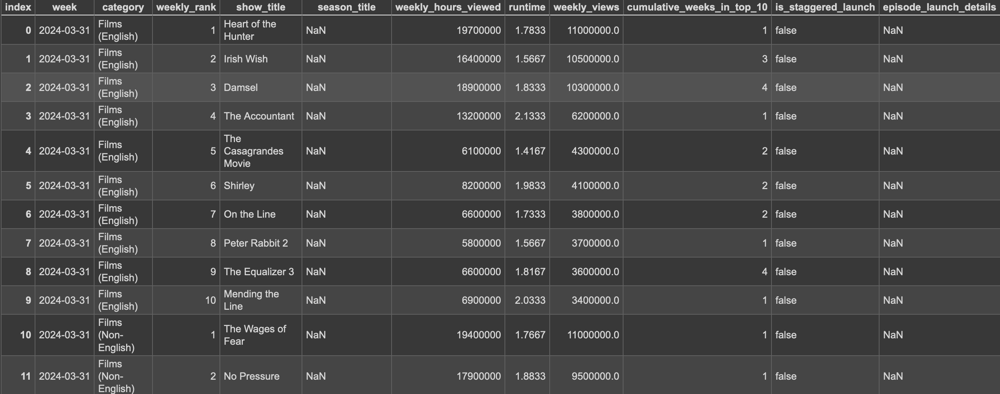
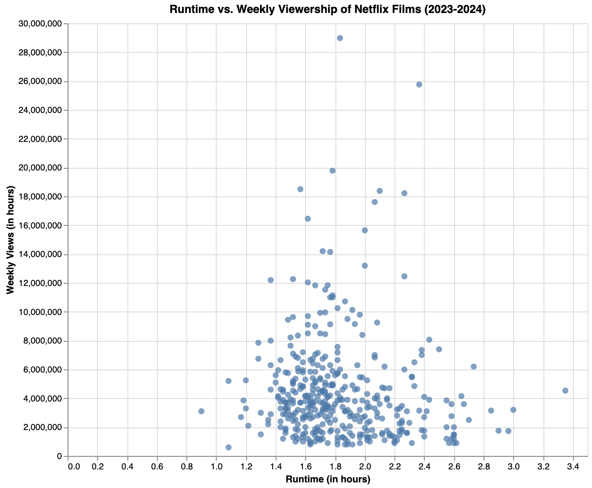
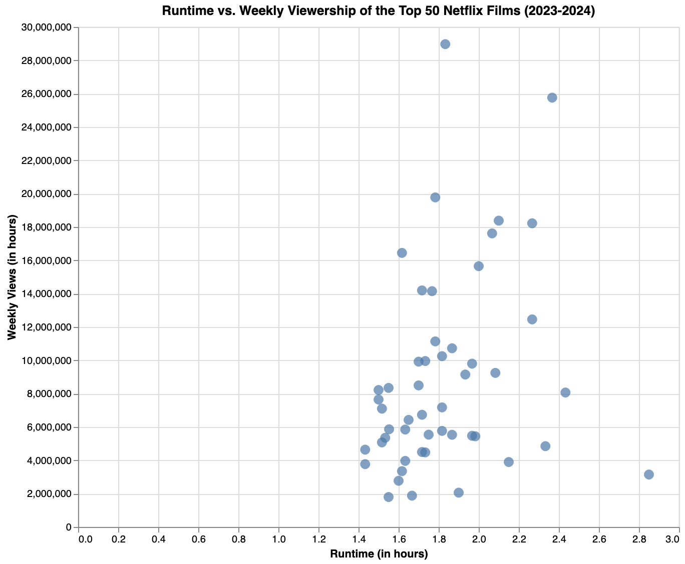
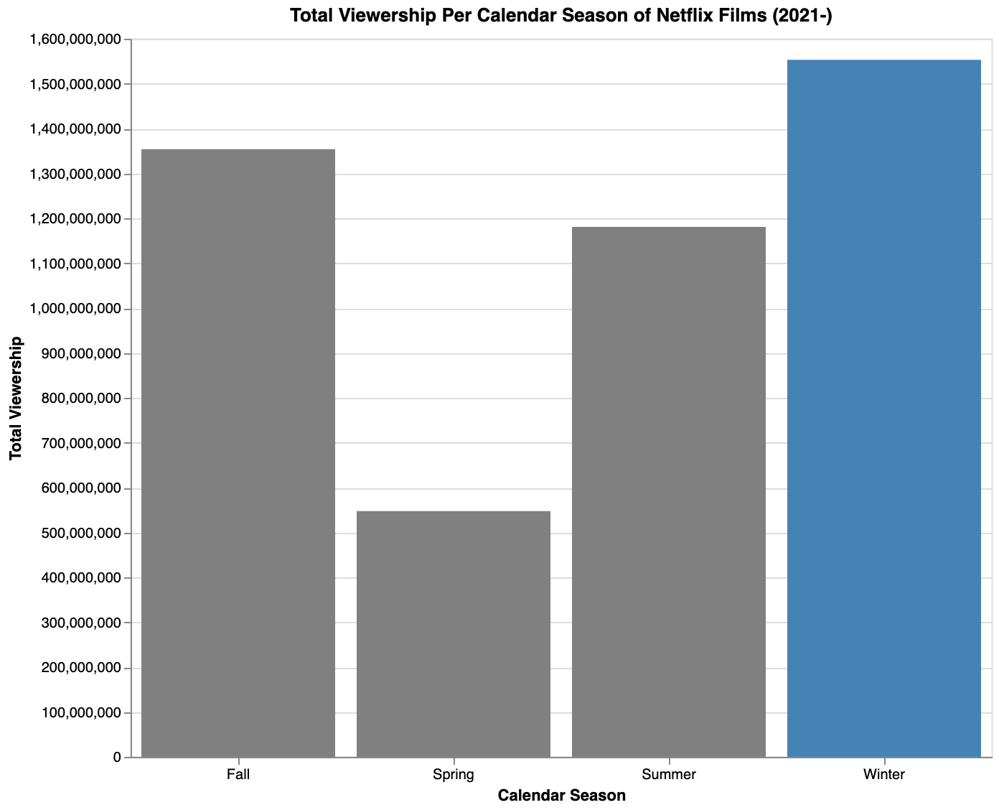

Ethan Landers | CS 625 | April 11th, 2024

Old Dominion University

# Semester Project

Click [here](https://colab.research.google.com/drive/15Z0Y3_eYU-PMwSIJ4-XGYdNBDaoJ52hA?usp=sharing) to access the Google Colab notebook used for this project.

## Description of Chosen Dataset
The dataset description can be accessed from Netflix [here](https://www.netflix.com/tudum/top10/) and downloaded directly as .xlsx from Netflix by clicking [here](https://www.netflix.com/tudum/top10/data/all-weeks-global.xlsx). Click [here](all-weeks-global.csv) to access the .csv version of the dataset I used for this project.

The dataset comes from Netflix, where they have published data every week since 2021 for four categories of entertainment:
* English films
* non-English films 
* English TV shows
* non-English TV shows

Netflix publishes to the dataset weekly a top ten ranking for each category of entertainment. The items in those top ten rankings are sorted from the highest to lowest amount of views on Netflix for that category of entertainment.

The dataset lists the top ten ranking's week, runtimes, weekly views, and more for each item in the top ten ranking for each category of entertainment.

The dataset comes as a .xlsx file, so to easily read the data in Python using the pandas library, I converted the .xlsx file into a .csv file through Microsoft Excel.

The image below is a screenshot of a subset of the dataset to view to help with visually understanding the dataset's structure:

## Final Refined Questions
I wanted to take a closer look at the dataset's film data in an attempt to gather meaningful results to understand how film runtime and calendar season influence weekly views.

Below are my final refined questions for this CS 625 semester project:
1. Does the runtime of Netflix films influence their weekly viewership?
    * Subquestion: Does the runtime of the top 50 Netflix films influence their weekly viewership?
2. Is viewership for Netflix films the highest during the winter compared to all other calendar seasons?

*To note, these final refined questions are worded subtly different than the original questions I posted in the [second project discussion post](https://canvas.odu.edu/courses/152735/discussion_topics/779337), as I did receive approval from Professor Ashok Veerasamy to refine them. This is discussed in more detail in the Final Results section of this report.*

## Visualizations

### Runtime vs. Weekly Viewership

#### Does the runtime of Netflix films influence their weekly viewership?

*Click [here](https://colab.research.google.com/drive/15Z0Y3_eYU-PMwSIJ4-XGYdNBDaoJ52hA?authuser=1#scrollTo=Question_1) to access the visualization within the Google Colab Notebook where it was created.*

When plotting this dataset, I realized that Netflix did not record the runtimes of films listed in Netflix's top 10 rankings each week for 2021 and 2022. So, I filtered those films out, and the visualization now only shows plot points for 2023 and 2024, as those films which made it into the top 10 rankings each week for those years do contain runtimes.

A big thing I did for the data before visualizing it was group it based on film title. There were many instances where the same film was in the top 10 ranking for several different weeks of the year; therefore, if I had not grouped the film titles together, then there would be points in the visualization representing the same film. Therefore, grouping reduces redundancy in this situation. However, grouping created a new Data Frame, and I needed to save some of the statistics from the original non-grouped Data Frame. So, for each film I saved to the new Data Frame the count of times the film appeared in the dataset (which was used to answer the following subquestion), the mean of the weekly views, and the mean of the runtime, in case there was any deviation among instances. I then plotted the visualization.

It is really unclear looking at the visualization whether there is a noticeable data trend. A majority of the Netflix films in the top 10 rankings plot points cluster with runtimes between 1.4 to 2.4 hours and weekly views averaging 1 million to 10 million views. There are many outliers with viewership numbers higher than that, where the highest weekly views for a film in this dataset is 28,000,000. Looking at the visualization, there is a rather weak positive trend, where the longer the film is, the more weekly views is receives; however, there are not enough films with weekly views over 10 million to support this.

So overall, there is no trend between runtime and weekly viewership when looking at *all* the Netflix films that made it into the top 10 rankings each week for 2023 and 2024.

Idiom: Scatterplot / Mark: Point
| Data: Attribute | Data: Attribute Type  | Encode: Channel | 
| --- |---| --- |
| Runtime (in hours) | Value, Quantitative | Horizontal Spatial Region (X-Axis) |
| Weekly Views (in hours) | Value, Quantitative | Vertical Spatial Region (Y-Axis) |

#### Subquestion: Does the runtime of the top 50 Netflix films influence their weekly viewership?

*Click [here](https://colab.research.google.com/drive/15Z0Y3_eYU-PMwSIJ4-XGYdNBDaoJ52hA?authuser=1#scrollTo=Subquestion) to access the visualization within the Google Colab Notebook where it was created.* 

I next wanted to ask the same question but look at a subset of the data that was looked at in the first question: the top 50 Netflix films that appeared in the top 10 rankings the most amount of weeks within the dataset. By doing so, I could determine how runtime affects viewership for the best of the best films.

The same as before, when plotting this dataset, I realized that Netflix did not record the runtimes of films in the top 10 rankings each week for 2021 and 2022. So, the visualization only shows plotted points for 2023 and 2024, as the films that made it into the top 10 rankings each week for those years do contain runtimes.

I used the grouped Data Frame from the previous question to answer this subquestion. I sorted it based on the number of times film titles appeared in the Data Frame, from the most to least amount of instances. I then only took 50 films from that sorted Data Frame to find the top 50 films on Netflix for 2023 and 2024.

With even less plot points for this visualization, it clearly showed that there was a positive trend, meaning that for the top 50 films on Netflix in 2023 and 2024, the longer the movie, the more weekly views there were.

There are three notable outliers in the data that should not be considered when drawing the final conclusion for this subquestion plot: Damsel with 28,975,000 weekly views, Leave the World Behind with 25,760,000 weekly views, and Jawan: Extended Cut with 3,150,000 weekly views. The first two listed movies had weekly views surpassing all other plot point weekly views, and Jawan: Extended Cut had a film length much longer than any other plot point at 2.85 hours.

Idiom: Scatterplot / Mark: Point
| Data: Attribute | Data: Attribute Type  | Encode: Channel | 
| --- |---| --- |
| Runtime (in hours) | Value, Quantitative | Horizontal Spatial Region (X-Axis) |
| Weekly Views (in hours) | Value, Quantitative | Vertical Spatial Region (Y-Axis) |

### Viewership vs. Calendar Season

#### Is viewership for Netflix films the highest during the winter compared to all other calendar seasons?

*Click [here](https://colab.research.google.com/drive/15Z0Y3_eYU-PMwSIJ4-XGYdNBDaoJ52hA?authuser=1#scrollTo=Question_2) to access the visualization within the Google Colab Notebook where it was created.*

To answer this question via visualization, I created a dictionary of calendar season key names mapped to three integers which represent the months of the year. I converted the 'week' column to date-time format for every row to then map its week in the top 10 ranking to a new calendar season string column. I then grouped the sum of the weekly views by season to get the total Netflix film views per calendar season.

In the dataset, I made the bar for winter steel blue and the other bars for the other calendar seasons gray so that it is easier to visually compare the results of the visualization.

The result is that winter was the calendar season with the highest total viewership for the Netflix films in the top ten weekly rankings since the start of the data set recording in 2021.

Here is the order of the calendar seasons with the highest (1) to lowest (4) total weekly viewership:
1. Winter `(1,553,100,000)`
2. Fall `(1,354,000,000)`
3. Summer `(1,180,800,000)`
4. Spring `(547,600,000)`

Idiom: Bar Chart / Mark: Bar
| Data: Attribute | Data: Attribute Type  | Encode: Channel | 
| --- |---| --- |
| Calendar Season | Key, Categorical | Horizontal Position on a Common Scale (X-Axis) |
| Total Viewership | Value, Quantitative | Vertical Spatial Region (Y-Axis) |

## Final Thoughts

### Refining Original Questions

I had intended to answer three questions that I originally came up with for the project's [second project discussion post](https://canvas.odu.edu/courses/152735/discussion_topics/779337) exactly as so, but as I was coding to produce these visualizations I realized that the original questions I wrote were either too vague, not possible to visualize, or not contributing to the overall visualization narrative. Therefore, I asked Professor Ashok Veerasamy if I could refine my original questions. I was granted permission to do so.

Below I list my original questions, my final refined questions, and why I made the change:

*Does the duration of English films streaming on Netflix influence weekly viewership?* 
Updated: **Does the runtime of Netflix films influence their weekly viewership?** 
* I updated the wording to be clearer. 
* Also, I expanded the question to include both English and Non-English films, which are both included in the dataset; including both of types of film makes phrasing the question and plot title easier while also giving a more comprehensive comparison of film runtime and viewership.

(Subquestion) *Does the duration of the top 50 English films of all time streaming on Netflix influence weekly viewership?* 
Updated: **Does the runtime of the top 50 Netflix films influence their weekly viewership?** 
* I updated the wording to be clearer. 
* Also, like previously,  I expanded the question to include both English and Non-English films, which are included in the dataset; including both of types of film makes phrasing the question and plot title easier while also giving a more comprehensive comparison of film runtime and viewership.

*Is viewership for films and TV shows streaming on Netflix the highest during the winter compared to all other seasons?* 
Updated: **Is viewership for Netflix films the highest during the winter compared to all other calendar seasons?** 
* Taking out TV shows from the question allows me to compare and connect the results of the previous two questions with this question, allowing me to better draw an overall conclusion for the project as a whole. Including TV shows feels odd because the previous questions would not connect with this one then.
* I used the wording “calendar seasons” instead of “seasons” because “seasons” can be connect with TV/film (i.e. Season 1), which is not my intended meaning.

### Development Process
One of the hardest things about developing these visualizations was making them interactive, which I had never done before. I utilized the Python library Altair, which I used to make the visualizations interactive. It took many trial and errors to understand the syntax of Altair and properly develop the visualizations. I did start with Matplotlib/Seaborn visualizations, but I converted them over to Altair interactive visualizations. I like the library and can see why it is so valuable. I see myself using the Python Altair library in the future. 

For more in-depth development process descriptions, refer to the respective refined question descriptions.

### Conclusion

To wrap up, I set out on a journey with this Netflix dataset to determine the correlation between runtime and weekly views for the films that appear in the Netflix top ten rankings each week. I also wanted to know the impact of which calendar seasons produced the highest viewership for this same subset of films.

I discovered that only for the top 50 films, the longer the film, the higher the viewership. Also, films in the winter time experienced the highest total viewership of all time compared to films in the top ten rankings each week for the fall, spring, and summer.

My recommendation to Netflix is release longer films and release major films in the winter time to capitalize on these trends.

## References
* https://altair-viz.github.io/user_guide/interactions.html
* https://docs.python.org/3/library/datetime.html
* https://altair-viz.github.io/user_guide/customization.html
* https://www.netflix.com/tudum/top10/